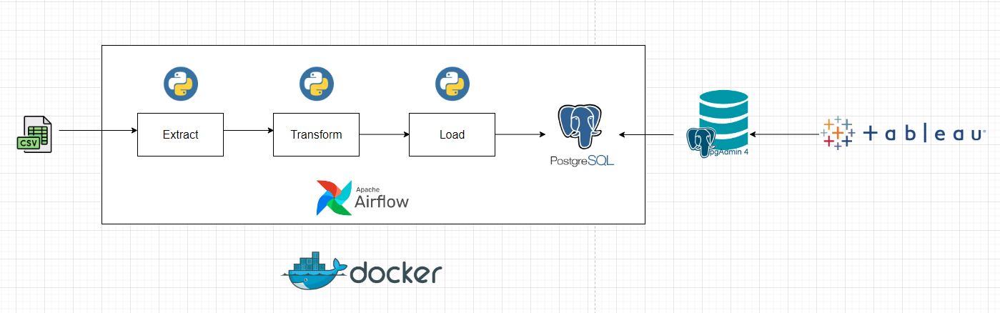

# An ETL data pipeline for S&P 500 Stock Data

## Goal Of The Project:
Read the stock CSV files downloaded from Kaggle, read the data as dataframe, do some transformations, create the table in Postgres and then load the transformed data into the table.

## Table of Contents:
<ol>
    <li><a href="#about_the_data"> <b>About The Data </a></b></li>
    <li><a href="#used_steps_tools"><b>Used Steps & Tools</b>
        <ul>
        <li><a href="#etl_workflow"><b> ETL Workflow </a></b></li>
        <li><a href="#extract"><b> Extract </a></b></li>
        <li><a href="#transform"><b> Transform </a> </b></li>
        <li><a href="#create_table"><b> Create Table </a> </b></li>
        <li><a href="#load"><b> Load </a> </b></li>
        <li><a href="#table"><b> Table </a> </b></li>
        <li><a href="#viz"><b> Candle-Charts </a> </b></li>
        </ul>
    </li>
</ol>

<h3 id ="about_the_data">1. About The Data:</h3>
The data used in this project has downloaded from Kaggle.
<a href="https://www.kaggle.com/datasets/camnugent/sandp500">Link to the data source. </a>
In total, the data has 7 columns.

<h3 id="used_steps_tools">2. Used Steps & Tools:</h3>
<ul>
        <li>
        <h4 id="etl_workflow">ETL Workflow</h4>
        
        So, in total, we have four different phases.
        Extract, transform, create the table and load, all of these tasks are orchestrated using Apache airflow and are built using task and dag decorators as well as PythonOperator.
        </li>
        <li>
        <h4 id="extract">Extract</h4>
        So, in this task, the data has been read in batches/chunk size. The data was almost 200K, since Spark was not used in this project, only PythonOperator was used to read the data, 
        because of the size of the data, it created huge load in Airflow leading to crashing of Airflow numerous, times due to which I decreased down the data records to almot 25K.
        </li> 
         
        <li>
        <h4 id="transform">Transform</h4>
        Once the reading has been done in the first task, the task returns the dataframe as JSON for using XCOM to pull the data in the second task i.e. transformation. In the transformation_data task, the JSON file has been pulled from task instance <i>ti</i>, then read as dataframe. Here, the profit column has been calculated based on the closing and opening price of the stock on that particular date. Then,again transformed the data to JSON and has been returned in this PythonOperator. 
        </li>
         
        <li>
        <h4 id="create_table">Create Table:</h4>
        Taskflow API has been used to create the table in PostgreSQL.
        </li>
        <li>
        <h4 id="load">Load</h4>
        Finally, the data has been loaded also created using TaskflowAPI, where tansform_data.output has been passed as an arguement.
        </li>
         
        <li>
        <h4 id="table">Table view</h4>
        Now, I have connected the database in PgAdmin to query the table. 
         
        
         
        
        <li>
        <h4 id="viz">Candle-Charts</h4>
        And finally, from Tableau, we have connected to the database and visualized as the candle chart for the stocks. Date(Year) and tickers are kept as the filter.     
         
        
         
         
        
        </li>
</ul>